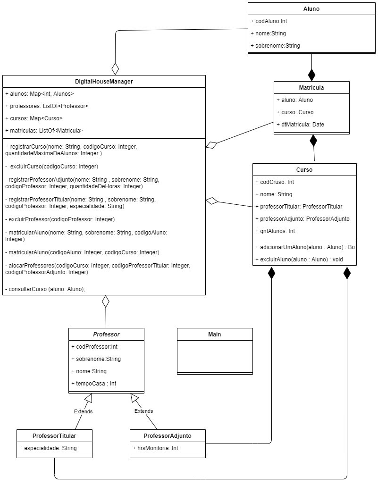

# Digital House - Santander Coders - Desafio 1 

* Desafio separado em exercicios de A a K, onde cada um foi feito em uma branch(para o acompanhamento passo a passo do exercicio) e depois feito o merge na master.
* Exercicio pode ser encontrado [aqui](https://github.com/Nogueira94/desafio1_digital_house/blob/master/Desafio1.pdf]).

# Aluno 
* Guilherme Nogueira

# UML Final

